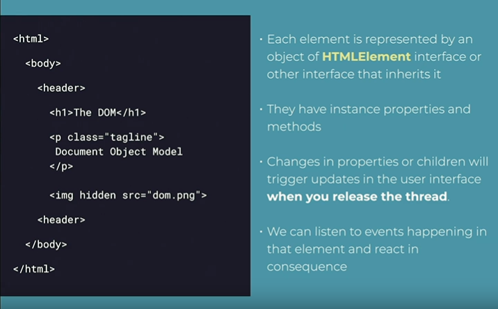
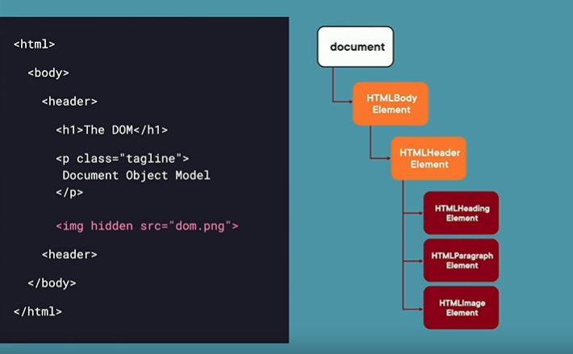

## Vanilla JavaScript

The usage of the core language and browser APIs to
create web apps without any additional libraries or
frameworks added on top.

## Why do we need to care about VanillaJS ?

- add one more tool to your toolbox
- Understand what your library is doing
- Extend your library with plugins
- Be a better web developer
- To mix with libraries
- Frontendmasters.com is VanillaJS!
- To use it
  You can create simple and fast web apps with not CLI, no build process.

## Main Advantages of Vanilla JS

- Lightweight
- Control and Power
- Simplicity
- Flexibility
- Performance
- Compatibility
- No node-modules

## Main Fear of Vanilla JS

- Routing for Single Page Applications
- Too Verbose and Time Consuming
- State Management
- Templating
- Complexity
- Reusable Components
- Maintenance
- Learning Curve
- Browser Compatibility
- Reinventing the Wheel every Time
- Scalability

## DOM

The Document Object Model connects web pages to JavaScript by representing the
structure of a document in memory.

## DOM API

A browser API exposed to developer to manipulate the DOM from an scripting language.

### The DOM API is available on many objects

**window** global object
**document** object
One object per HTML element and other need in your document.



### TO work with DOM elements , we can...

- Pick them from the current DOM
- Create them , and then inject then into the DOM

### When we have a reference to an element we can

- Read its content
- Change its content
- Remove it
- Add new elements to it

## Select elements from the DOM

- By ID
- By Class Name
- By Name
- By css Selector
- Navigating DOM structure

### When selecting elements , some functions return...

- One HTML element (HTMLElement)
- A Live HTML element collection (HTMLCollection)
- Static element collection (NodeList)

### Function to get a reference to one DOM element

- getElementById
- querySelector

When you use a Function that returns one element, it can also return null if no
node was found.

### Function to get a reference to multiple DOM elements

- getELementByTagName
- getElementByClassName
- querySelectorAll()
- getElementByName

When you use a function that returns multiple elements, it ca also return
an empty collection if no element were found.

HTMLCollection (live) don't have all the modern Array interface, such as
filter, map , reduce or forEach.

You can add modern array functions to HTMLCollection by creating
a Array from it using Array.from(collection)

## With an HTML Element in JavaScript you can

- Read and change attributes value
- Read and change styles
- Hook event listeners
- Add,remove or move children elements
- Read and change it contents
- More APIs

## How to read or change attribute of DOM element

```javascript
element.hidden = false;
element.src = "logo.png";
element.className = "myClass";
```

## How to read or change styles of DOM element

```javascript
element.style.color = "blue";
element.style.fontSize = "1.2em";
element.style.borderRightColor = "#FCFCFC";
```

## How to listen to event of an HTML element

```javascript
element.addEventLister('event name', function)
```

or

```javascript
function eventHandler(event) {
  // do something
}
element.addEventLister("event name", eventHandler);
```

or this way too

```javascript
element.addEventLister("click", (event) => {
  // do something
});
```

### Accessing and Editing Contents of the Elements

- Accessing textContent
- Accessing innerHTML
- Using DOM APIs to create new nodes

#### Working with textContent

```javascript
const element = document.querySelector("#message");

// we read the current element's content as string
const content = element.textContent;

// We change the contents of the element with a new string
element.textContent = "The text has been changed";
```

#### Working with innerHTML

```javascript
const element = document.querySelector("#section-6 header");

// we read the current element's content as string
const content = element.textContent;

// We change the contents of the element with a new string
element.textContent = `
  <h1>My App</h1>
  <p>The best platform for learning frontend</p>
`;
```

#### Working with DOM API to create or edit content

```javascript
const element = document.querySelector("#section-6 header");

const h1 = document.createElement("h1");
h1.textContent = "My App";
element.appendChild(h1);

const p = document.createElement("p");
p.textContent = "The best platform for learning frontend";
element.appendChild(p);
```

## Scoping querySelector

querySelector always pick the first element if you want multiple you have to use querySelectorAll it's pick them inside array
if the thing you select is not exist the querySelector will show null but querySelectorAll show empty NodeList.

if we have nav and we want to get the span inside it we do this

```javascript
document.querySelector("span#badge");
```

now we add query for hole DOM we can narrow this like this

```javascript
const nav = document.querySelector("nav");
nav.querySelector("span#badge");
```

now we scope the DOM it's only search inside the nav which can improve the Performance 